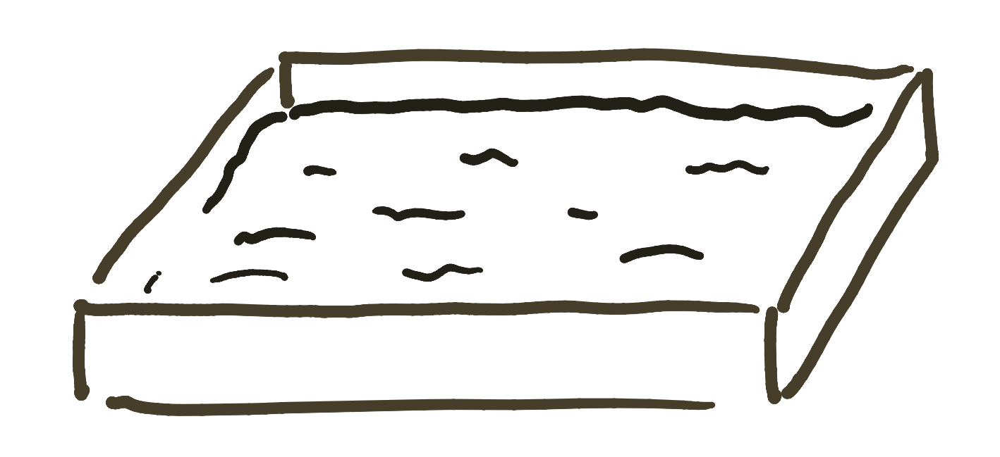
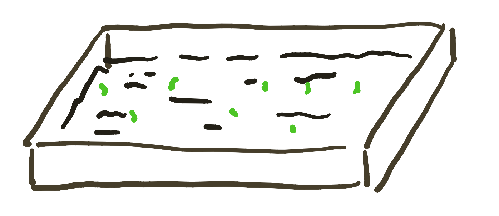
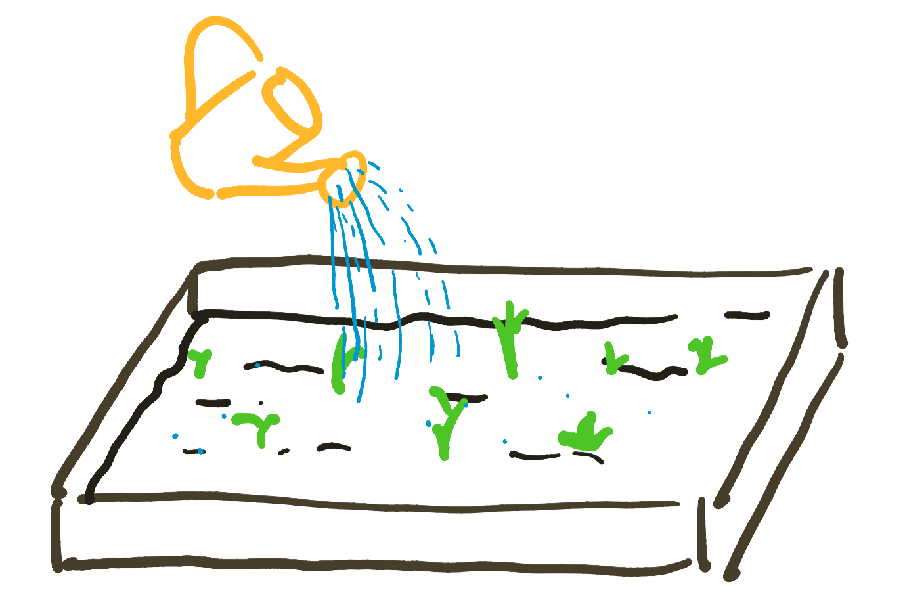
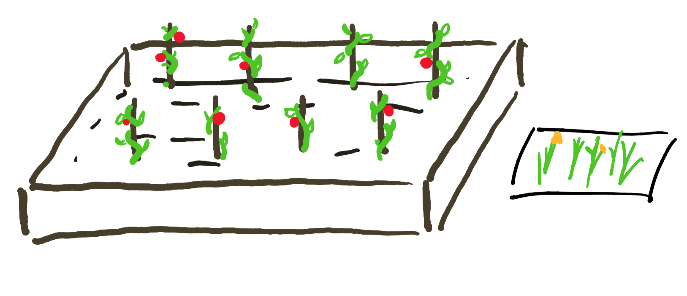

The first image that comes to my head when I hear the word 'gardening' is of a small plot with some leafy greens sprouting their heads from an earthy bed. A gardener tenderly shovels and removes unwanted weeds and pours water to nourish the plants he wants to grow. He takes care to make sure the soil isn't too wet and that each plant has ample space to grow. When the time comes, he harvests each fruit and vegetable and makes sure to plant seeds so that he can repeat the process anew in a few weeks time.

A garden is a metaphor for a lot of things: growth, persistence, and the constant battle against entropy.

When I talk about digital gardening, I don't mean digital gardening in the Stardew Valley or FarmVille sense. I mean gardening as in the tending and growth of my own ideas and projects on my own little plot of the world wide web &mdash; namely through my blog, personal site, and GitHub projects. After reading Joel Hook's blog post on his own [digital garden](https://joelhooks.com/digital-garden), I've been thinking and reflecting on my own processes for managing my garden.

I wanted to use this blog post as a way for me to document said processes and, in a sort of meta-round-a-bout way, grow and refine this process further.

## The garden plot
According to [GitHub](https://github.com/jackyzha0/blog/commit/74f7460c49a7c56acfadf3f8f1cdd892005ebed4), I first created this blog in late August of 2020. At the time, it was more of a novelty thing. I wanted to get off of Medium and onto my own platform where I had more fine-grained control over how I could present my work and how people discover it.

I spent a few hours building out my own Hugo theme, making it as frictionless as possible to write produce new content. I threw up a few of my old Medium blog posts just to see how it would look, and I was happy with it. However, even with the novelty of the blog, I had nothing to write about.

The plot was there; I just didn't have anything to plant in it.

## Planting the seeds

If you have no seeds in your garden, the only things that will grow are weeds. I could barely remember the last time I read a book on my own time. Needless to say, garbage in, garbage out.

Over the summer, I began to read again. Technical write-ups, fiction novels, traversing into self-help, and memoirs. I started to read more about the state of the world and critically discuss these with family and friends. Reading helped me colour in the lines as to why we need to build in the first place. I started to realize that the problems we try so hard to solve with technology are not actually tech problems, but inherently human ones.

I've started to write more about some these ideas (like within this blog post!), at first to help me organize my own thoughts, but eventually segued into an excuse for me to talk to people about interesting ideas and get their perspective. It's started a sort of chain reaction, with observations from a book leading to a conversation with a friend to a blog post ad infinitum. I've been able to slowly build up my [base of knowledge](/posts/collaborative-thinking/) so that I can contribute meaningfully to conversations.

These are the seeds I plant in my garden, but these seeds will stay seeds unless watered.

## Watering the plants

I have a Notion page of random thoughts and ideas. Whenever I come across something interesting in a conversation or book or article, I file it away in this Notion page. Slowly, categories have appeared as blog posts, articles, and papers coalesce and self-organize.

This input of information -- the water -- is what allows the ideas to grow. Just as it's not enough to just water a plant once and forget about it, I've found that in-taking information inconsistently is about as good as not doing it at all. To be an effective watering can, I need to be intentional and consistent with my watering.

My process of collecting random scraps of information first sprung up from coming across interesting blog posts on Reddit. I'd always just read a cool post, follow a few hyperlinks, nod to myself and say "huh", and maybe forward it to a friend or two. While it may have been entertaining to read, I got no value out of it. Now that I've started cultivating this garden of ideas, I have a reason to be more intentional in how I sift through the information and be more mindful of what I'm actually taking away from each piece. Writing, specifically on this blog and on my newsletter (which you can subscribe to at the bottom of this page), has helped me to go back to more mature ideas and condense and refine them into something presentable and legible to others -- quite literally picking the fruit of my labour. 

> We are all constantly bombarded with information, a lot of it is really good information too, but the challenge is absorbing it and applying it to the context of our lives and careers. &mdash; Joel Hooks

Now that I have all of these new-found ideas and tidbits of information, what do I do with them? Keep growing them forever? At some point on the [explore-exploit curve](https://towardsdatascience.com/intro-to-reinforcement-learning-the-explore-exploit-dilemma-463ceb004989), this knowledge should be applied to something in order to manifest it into something useful. The problem is, which ideas get priority of my time and effort?

## Pulling weeds

No garden has unlimited space or nutrition to go around. Maybe you have a bigger garden than most, but that doesn't mean you can grow whatever you want silly-willy. Some will need more space than others and others you simply just cannot grow in the same garden plot.

Similarly, no one has unlimited time and energy they can put into projects and learning. I, unfortunately, have yet to fully learn this lesson. After having an empty plot for so long, having a little greenery show up has inspired me into a planting frenzy, trying to cram as much into the garden as possible.

I'm starting to step back and reflect on my current commitments and deciding to either to step down from things that I'm less passionate about to make more time and room to double down on the things I'm truly passionate about.

## End

None of what I do is perfect. Looking back at writing from a year ago, reading code from a few months ago even, makes me cringe a little. Like any garden, this one evolves and grows over time; there is no 'end-state' that I'm trying to get the garden to. This little garden is just a little place for me to experiment, to push out things that I'm working on, and to provide snapshots of all the in-progress things going on in my life.

Through tending to this garden in public, I hope to show my success, failures, and everything in between and offer it as an open garden to learn from for anyone who stumbles upon it in the future. If just one person is inspired by it, learns from a mistake I made, or builds off of my work, then I would consider this garden a success.

Maybe you'll find this as an incentive to start your own.